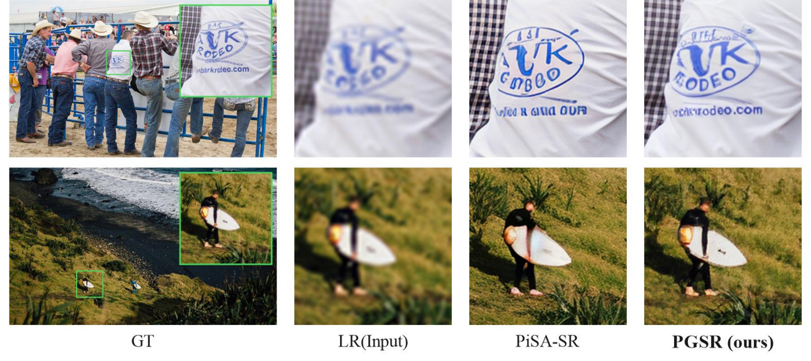
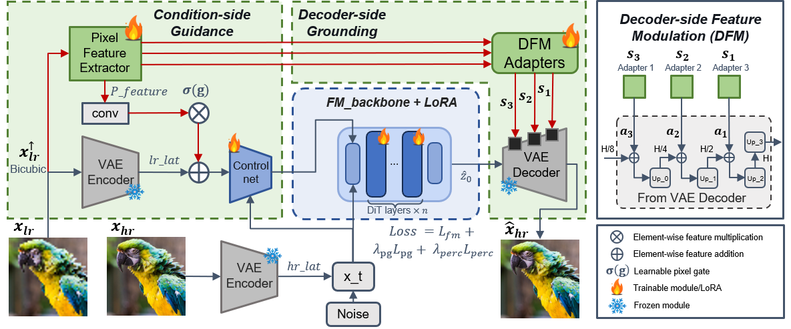
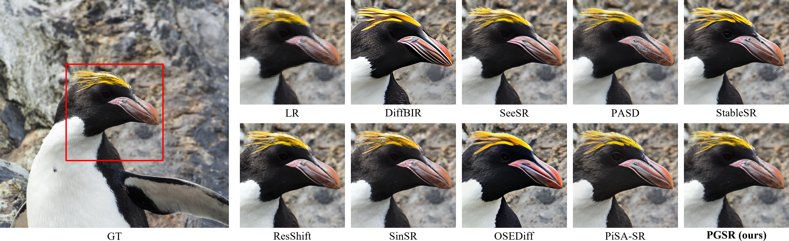
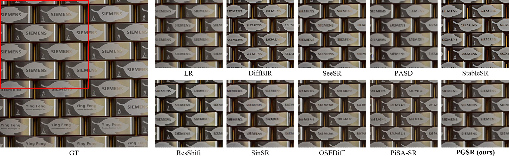
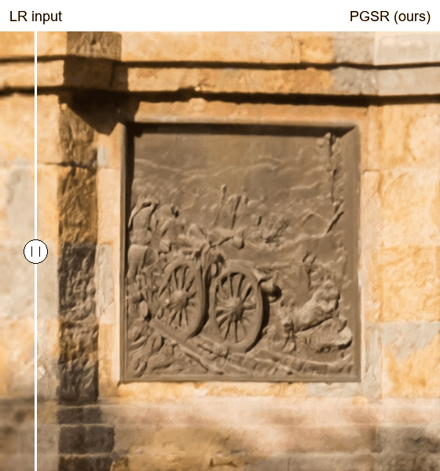
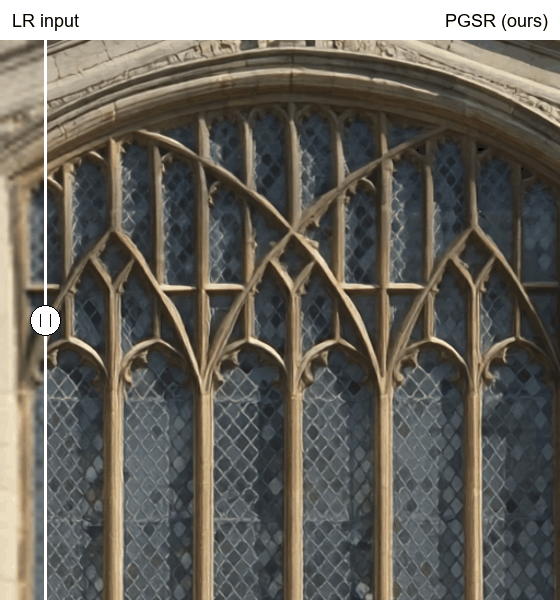
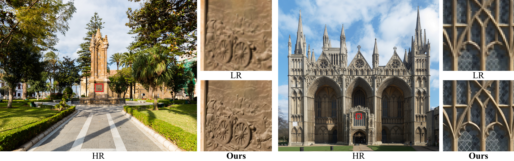

<div align="center">

# When Latents Forget Pixels: Restoring Fidelity in Diffusion Transformer Super-Resolution

**NeurIPS 2026 · Poster**

[Paper (arXiv)](https://arxiv.org/abs/2608.09133) · [Method](#method-overview) · [Visual Results](#visual-results) · [Installation](#installation) · [Inference](#inference) · [Training](#training)

</div>

Official implementation of **Pixel-Grounded Super-Resolution (PGSR)**.
PGSR preserves pixel-level evidence from the low-resolution input and reuses it
to guide both the diffusion trajectory and VAE decoding, based on FLUX.1-dev.



*From left to right: LR input, restoration without pixel guidance, PGSR (ours), and ground truth. Zoomed regions highlight text and fine structural details.*

## News

- **Coming soon:** PGSR checkpoints.
- **2026-09:** PGSR accepted to **NeurIPS 2026 as a poster**!
- **2026-08-10:** Our [paper](https://arxiv.org/abs/2608.09133) is available on arXiv.
- **2026-08-03:** Training and evaluation code organized for release.

## Highlights

- **Condition-side guidance:** fuse LR pixel features with the VAE latent condition to guide restoration.
- **Decoder-side grounding:** inject multi-scale pixel features into the frozen VAE decoder.
- **Sparse attention:** an optional local-window variant, adapted from CLEAR, for high-resolution inference.

## Method Overview



PGSR reuses LR-derived pixel evidence in both the latent conditioning pathway
and the frozen VAE decoder. See the [paper](https://arxiv.org/abs/2608.09133) for details.

## Visual Results

### DIV2K super-resolution



### Real-world super-resolution



### High-resolution demos

**LR input (left) / PGSR (right).** The divider sweeps automatically in these
README-native previews. Both sides use the same spatial crop from the actual
input and output; LR is bicubic-enlarged for display without extra blur or sharpening.

**Carved stone · DIV8K 0492 · 4× SR (1680 × 1296 → 6720 × 5184)**



**Window tracery · DIV8K 0467 · 4× SR (1680 × 1584 → 6720 × 6336)**



<details>
<summary>Full-image context and display notes</summary>



GIFs are 256-color web previews, not evaluation images. Crop coordinates and
display settings are recorded in [assets/demo-crops.json](assets/demo-crops.json).

</details>

## Installation

The code was tested with Python 3.11, PyTorch 2.5.1, Diffusers 0.36.0, Accelerate 0.34.0, Transformers 4.57.5, and PEFT 0.18.1.

```bash
conda create -n pgsr python=3.11 -y
conda activate pgsr

pip install torch==2.5.1 torchvision==0.20.1 --index-url https://download.pytorch.org/whl/cu121
pip install diffusers==0.36.0 accelerate==0.34.0 transformers==4.57.5 \
  peft==0.18.1 deepspeed lpips scikit-image pyiqa
```

Request access to [FLUX.1-dev](https://huggingface.co/black-forest-labs/FLUX.1-dev)
and authenticate with Hugging Face before running the code. The default ControlNet
initialization is [Flux.1-dev-Controlnet-Upscaler](https://huggingface.co/jasperai/Flux.1-dev-Controlnet-Upscaler).
Model identifiers can be replaced by local paths through the command-line arguments.

## Data

The paper uses the following datasets:

- **Stage 1:** DF2K (DIV2K + Flickr2K), with paired bicubic x4 LR-HR images.
- **Stage 2:** the union of DF2K, LSDIR, FFHQ, and OST. LR inputs are synthesized online with the second-order Real-ESRGAN degradation pipeline.
- **Evaluation:** DIV2K validation, RealSR, and DRealSR.

Place downloaded datasets under `Data/`, or pass their locations directly with `--hr_dir`, `--lr_dir`, `--val_hr_dir`, and `--val_lr_dir`.

## Inference

The examples below require a trained PGSR checkpoint. Public checkpoints are not yet released; use a checkpoint from your own training in the meantime.

### Full attention

```bash
CUDA_VISIBLE_DEVICES=0 python evaluate_pgsr.py \
  --checkpoint checkpoints/pgsr/best_model.pt \
  --lr_dir Data/DIV2K/DIV2K_valid_LR_bicubic_X4 \
  --hr_dir Data/DIV2K/DIV2K_valid_HR \
  --num_steps 20 \
  --iqa_device cuda \
  --lpips_device cuda
```

Results and metrics are written to `outputs/`. The HR directory is optional when only restored images are needed.

### Sparse attention

Use a matching sparse-attention PGSR checkpoint. The default configuration also
requires the [official CLEAR initialization weights](https://huggingface.co/Huage001/CLEAR)
matching the training window size and downsampling factor:

```bash
CUDA_VISIBLE_DEVICES=0 python evaluate_pgsr_sparse.py \
  --checkpoint checkpoints/pgsr_sparse/best_model.pt \
  --sparse_ckpt ckpt/clear_local_16_down_4.safetensors \
  --attention_mode sparse \
  --lr_dir Data/DIV2K/DIV2K_valid_LR_bicubic_X4 \
  --num_steps 20
```

`--attention_mode auto` detects the attention configuration stored in the checkpoint.
Sparse attention uses PyTorch FlexAttention / Triton and requires a compatible CUDA environment.

## Training

PGSR uses two-stage training: paired bicubic pretraining followed by Real-ESRGAN degradation fine-tuning. The complete commands and resume settings are documented at the top of `train_pgsr.py`.

```bash
accelerate launch --num_processes=8 --gradient_accumulation_steps=8 \
  train_pgsr.py \
  --hr_dir Data/DF2K_HR \
  --lr_dir Data/DF2K_LR_bicubic_X4 \
  --degrade_mode paired \
  --val_hr_dir Data/DIV2K/DIV2K_valid_HR \
  --val_lr_dir Data/DIV2K/DIV2K_valid_LR_bicubic_X4 \
  --scale 4 --resolution 512
```

For sparse-attention training, use `train_pgsr_sparse.py` with the same data
arguments and add `--sparse_ckpt ckpt/clear_local_16_down_4.safetensors`.
Configure the attention pattern with `--sparse_window_size` and `--sparse_down_factor`.
Training resolution must be divisible by `16 * sparse_down_factor`.

## Repository Guide

| Path | Purpose |
| --- | --- |
| `train_pgsr.py` / `evaluate_pgsr.py` | Full-attention training and inference |
| `train_pgsr_sparse.py` / `evaluate_pgsr_sparse.py` | Sparse-attention training and inference |
| `sparse_attention/` | Local-window attention implementation and upstream attribution |
| `configs/` | Distributed-training configuration |
| `train/` | Earlier research variants; use the root-level entry points for PGSR |

The sparse entry points were renamed from `*_pgsr_clear.py`.
Legacy `--clear_*` options and checkpoint fields remain supported, so existing
PGSR sparse checkpoints do not need conversion. See [compatibility notes](sparse_attention/README.md).

## Acknowledgements

This implementation builds on [Diffusers](https://github.com/huggingface/diffusers), [FLUX.1-dev](https://huggingface.co/black-forest-labs/FLUX.1-dev), and the [FLUX ControlNet Upscaler](https://huggingface.co/jasperai/Flux.1-dev-Controlnet-Upscaler).

## Citation

```bibtex
@article{shi2026latents,
  title={When Latents Forget Pixels: Restoring Fidelity in Diffusion Transformer Super-Resolution},
  author={Shi, Yu and Zhang, Yuyao and Tai, Yu-wing},
  journal={arXiv preprint arXiv:2608.09133},
  year={2026}
}
```
